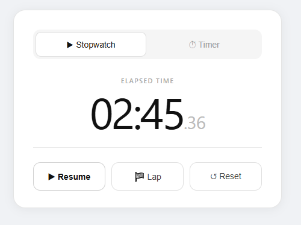
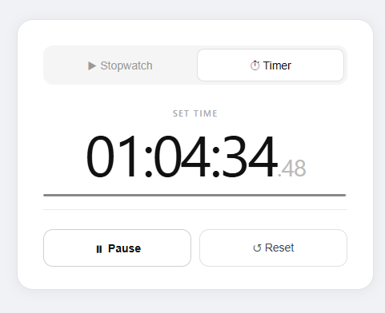

# ⏱️ Stopwatch Timer App

A clean, responsive stopwatch and timer web application built for precision and simplicity.

🔗 **Live Demo:** [https://stopwatch-timer-app-six.vercel.app/](https://stopwatch-timer-app-six.vercel.app/)

---

## ✨ Features

- ▶️ **Start / Pause / Reset** — Full control over your stopwatch
- 🏁 **Lap Recording** — Track multiple lap times with ease
- ⏳ **Timer Mode** — Set a countdown and get notified when it ends
- 📱 **Responsive Design** — Works seamlessly on desktop and mobile
- ⚡ **Fast & Lightweight** — No dependencies, loads instantly

---
## 🛠️ Tech Stack

| Technology | Purpose |
|------------|---------|
| React.js | UI Framework |
| CSS Modules | Styling & Animations |
| JavaScript | Core Logic |
| Vercel | Hosting & Deployment |

---

## 📁 Project Structure

```
stopwatch-timer/
├── public/                   # Static assets
├── src/                      # Source files
│   ├── components/           # React components
│   │   ├── Controls.js       # Start / Pause / Reset controls
│   │   ├── CountdownInput.js # Timer countdown input
│   │   ├── Stopwatch.js      # Stopwatch main component
│   │   ├── TimeDisplay.js    # Time display component
│   │   └── Timer.js          # Timer logic component
│   ├── App.css               # Global app styles
│   ├── App.js                # Root app component
│   ├── App.test.js           # App tests
│   ├── index.css             # Base styles
│   ├── index.js              # App entry point
│   ├── logo.svg              # App logo
│   ├── reportWebVitals.js    # Performance reporting
│   └── setupTests.js         # Test setup
├── .gitignore                # Git ignored files
├── package-lock.json         # Exact dependency tree
├── package.json              # Project config & scripts
└── README.md                 # Project documentation
```

---
## 📸 Project Screenshots

<p align="center">
  
  &nbsp;&nbsp;
  
</p>
---

## 🤝 Contributing

Contributions are welcome!

1. Fork the repository
2. Create a new branch: `git checkout -b feature/your-feature`
3. Commit your changes: `git commit -m "Add your feature"`
4. Push to the branch: `git push origin feature/your-feature`
5. Open a Pull Request

---
## 🚀 Getting Started

### Prerequisites

Make sure you have the following installed:

- [Node.js](https://nodejs.org/) (v16 or higher)
- [npm](https://www.npmjs.com/) or [yarn](https://yarnpkg.com/)

### Installation

```bash
# Clone the repository
git clone https://github.com/Bushra3895/Stopwatch-Timer-App.git

# Navigate into the project
cd stopwatch-timer

# Install dependencies
npm install
```

### Running Locally

```bash
npm run dev
```

Open [http://localhost:3000](http://localhost:3000) in your browser.

### Build for Production

```bash
npm run build
```

---

## 🌐 Deployment

This app is deployed on **Vercel**.

To deploy your own version:

1. Push your code to GitHub
2. Go to [vercel.com](https://vercel.com) and import your repository
3. Click **Deploy** — done!

---


## 📄 License

This project is licensed under the [MIT License](LICENSE).

---

## 🙋‍♂️ Author

Made with ❤️ by **Bushra Shabbir** — Feel free to reach out or star ⭐ the repo if you found it useful!
